<div align="center">
  <h1>🚀 Advance AI-Powered Lead Management System</h1>
  <p><b>An enterprise-grade n8n automation for processing leads, deep email verification, and AI-driven personalized outreach.</b></p>

  <p>
    
    
    
    
  </p>
</div>

---

## ⚡ Overview

This intelligent workflow acts as a complete **Customer Success Pipeline**. It automatically captures new leads, runs them through a rigorous **5-layer email verification process**, generates highly personalized welcome emails using an AI Agent, and gracefully handles delivery statuses and hard bounces—all while keeping the team notified via Slack.

## ✨ Key Features

* **🛡️ 5-Layer Email Verification:** Protects domain reputation by filtering out fake emails before sending.
    * *Layer 1-3:* Syntax check, Disposable domain block, and Role-based prefix filtering (`admin@`, `info@`).
    * *Layer 4:* Live Google DNS MX Record check.
    * *Layer 5:* Deep SMTP mailbox ping via custom Railway Flask API.
* **🧠 AI-Driven Personalization:** Utilizes LangChain and OpenAI to instantly draft hyper-personalized, context-aware welcome emails based on the lead's specific interests.
* **🗄️ Real-Time Supabase Sync:** Automatically updates lead status (`Pending`, `Sent`, `Invalid Email`, `Failed`, or `Bounced`) directly in the database.
* **💬 Comprehensive Slack Alerts:** Sends instant notifications for successful outreaches, invalid lead blocks, AI generation failures, and email delivery issues.
* **♻️ Autonomous Bounce Tracking:** A dedicated background trigger watches the Gmail inbox for "Delivery Status Notifications" and automatically flags hard bounces in Supabase.

---



```mermaid
graph LR
    %% Styles
    classDef trigger fill:#ea4b71,stroke:#fff,stroke-width:2px,color:#fff,border-radius:5px
    classDef loop fill:#f39c12,stroke:#fff,stroke-width:2px,color:#fff
    classDef db fill:#3ecf8e,stroke:#fff,stroke-width:2px,color:#000
    classDef code fill:#2980b9,stroke:#fff,stroke-width:2px,color:#fff
    classDef api fill:#8e44ad,stroke:#fff,stroke-width:2px,color:#fff
    classDef condition fill:#e67e22,stroke:#fff,stroke-width:2px,color:#fff
    classDef ai fill:#412991,stroke:#fff,stroke-width:2px,color:#fff
    classDef email fill:#ea4335,stroke:#fff,stroke-width:2px,color:#fff
    classDef slack fill:#4a154b,stroke:#fff,stroke-width:2px,color:#fff
    classDef wait fill:#7f8c8d,stroke:#fff,stroke-width:2px,color:#fff

    %% -----------------------------------------------------
    %% 1. Lead Ingestion & Trigger
    %% -----------------------------------------------------
    subgraph Lead Capture & Batching
        W[Webhook]:::trigger --> RW(Respond to Webhook)
        W --> INL[(Index New Lead<br>Supabase)]:::db
        ST[Schedule Trigger]:::trigger --> G50[(Get 50 Leads<br>Supabase)]:::db
    end

    INL --> LOI((Loop Over<br>Items)):::loop
    G50 --> LOI

    %% -----------------------------------------------------
    %% 2. Verification Engine
    %% -----------------------------------------------------
    subgraph 5-Layer Verification Pipeline
        LOI --> L1[Layer 1-3: Syntax<br>+ Disposable + Role]:::code
        L1 --> L4[Layer 4: Google DNS<br>MX Check]:::api
        L4 --> L5[Layer 5: Railway API<br>SMTP Check]:::api
        L5 --> V_Check{SMTP Result<br>Valid?}:::condition
    end

    %% -----------------------------------------------------
    %% 3. Invalid Route
    %% -----------------------------------------------------
    V_Check -- False --> IEU[(Invalid Email Update)]:::db
    IEU --> W1((Wait)):::wait
    W1 --> ISlack[Invalid Lead Notifier]:::slack
    ISlack --> LOI

    %% -----------------------------------------------------
    %% 4. Valid Route (AI Generation & Sending)
    %% -----------------------------------------------------
    V_Check -- True --> W2((Wait 5s)):::wait
    W2 --> Agent[Lead Man. AI Agent]:::ai
    
    %% AI Sub-components
    GPT((OpenAI Chat Model)) -.-> Agent
    Parser((Output Parser)) -.-> Agent

    %% AI Outcomes
    Agent -- Success --> Gmail[Send a message<br>Gmail]:::email
    Agent -- Error --> AI_Fail[(AI Gen Failed Update)]:::db
    
    AI_Fail --> AI_Slack[AI Gen Failed<br>Notifier]:::slack
    AI_Slack --> W5m((Wait 5m)):::wait
    W5m --> LOI

    %% -----------------------------------------------------
    %% 5. Delivery Outcomes
    %% -----------------------------------------------------
    Gmail -- Success --> G_Success[(Gmail Sent Update)]:::db
    G_Success --> S_Slack[Success Lead Notifier]:::slack
    S_Slack --> W10s((Wait 10s)):::wait
    W10s --> LOI

    Gmail -- Error --> G_Fail[(Failed Gmail Sent)]:::db
    G_Fail --> F_Slack[Delivery Failed<br>Notifier]:::slack
    F_Slack --> W7s((Wait 7s)):::wait
    W7s --> LOI

    %% -----------------------------------------------------
    %% 6. Background Bounce Watcher (Independent Flow)
    %% -----------------------------------------------------
    subgraph Autonomous Bounce Tracker
        direction LR
        GT[Gmail Trigger<br>Watch Bounces]:::trigger --> EBE[Extract Bounced Email]:::code
        EBE --> BEF{Bounced Email<br>Found?}:::condition
        BEF -- True --> BIEU[(Bounced Email Update)]:::db
        BIEU --> Bounce_Slack[Slack - Bounce Alert]:::slack
    end
```

## 🏗️ Architecture & Workflow

1.  **Trigger:** Initiated via Webhook (for instant lead capture) or a 10-minute Schedule Trigger (batch processing 50 leads at a time).
2.  **Verification:** Routes through the custom validation pipeline. Invalid emails are instantly rejected and logged.
3.  **AI Generation:** Valid leads are passed to the LangChain AI Agent to draft the perfect HTML email body and subject line.
4.  **Delivery:** Emails are dispatched via Gmail.
5.  **Logging:** Supabase is updated with the exact timestamp and email draft.
6.  **Bounce Handling:** A separate Gmail trigger specifically watches for mail delivery failures and automatically updates the database to prevent future attempts.

---

## 🚀 Setup & Installation

### Prerequisites
You will need active accounts and API credentials for the following services:
* [n8n](https://n8n.io/) (Self-hosted or Cloud)
* [Supabase](https://supabase.com/) (PostgreSQL Database)
* [OpenAI](https://openai.com/api/) (GPT-4 API Key)
* Gmail (OAuth2 configuration)
* Slack (Incoming Webhooks / Bot Token)
* Custom Email Verifier API (Hosted on Railway)

### Import the Workflow
1. Download the `workflow.json` file from this repository.
2. Open your n8n workspace.
3. Click on **Add Workflow** > **Import from File**.
4. Select the downloaded JSON file.

### Configure Credentials
After importing, you will need to reconnect the following nodes to your own credentials:
* `SupabaseApi` (Advance AI-Powered Lead Management System)
* `OpenAiApi`
* `GmailOAuth2`
* `SlackApi`

### Environment Variables
Ensure the **Layer 5: Railway API — SMTP Check** HTTP node is pointing to your active verification API URL:
```text
[https://YOUR-APP-NAME.up.railway.app/check](https://YOUR-APP-NAME.up.railway.app/check)
```

## 🤝 Contribution
Feel free to fork this repository and submit pull requests. For major changes, please open an issue first to discuss what you would like to change.

---

### 📬 Connect with Me

[](https://www.google.com/search?q=https://www.linkedin.com/in/uba-chan)
[](mailto:aivibe@ubachan.site)


---
